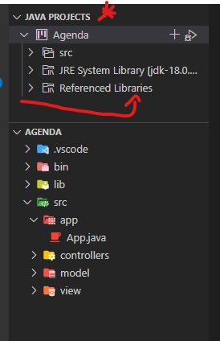
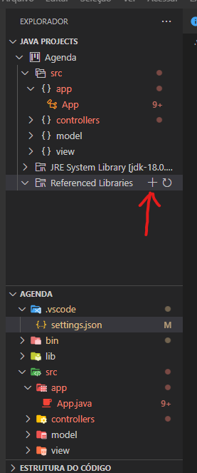
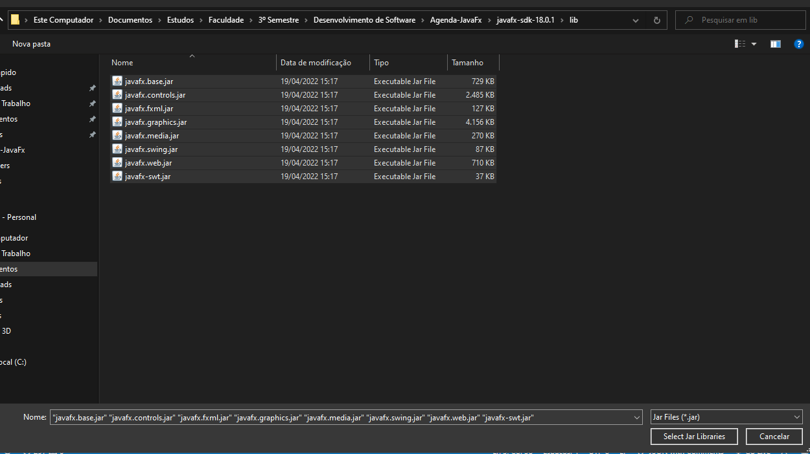

# Agenda-JavaFx
Uma agenda criada em JavaFx

Para que esta agenda funcione é nessessário importar as bibliotecas JavaFx manualmente pelo VS Code.

Primeiro Abra o arquivo App no editor

Depois disso vai aparecer a aba Java Projects

Clique em Referenced Libraries e depois no "+"

Agora selecione as bibliotecas da pasta lib em javafx-sdk-18.0.1

O programa deve funcionar corretamente.

obs: Professor caso de xabu chama no zap 41995656056
